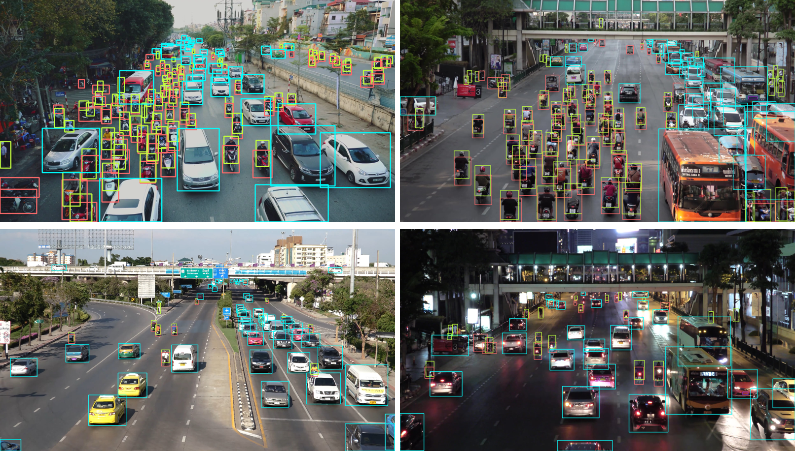

# SEU_PML Dataset

### Simple introdution
SEU_PML Dataset is a large and detailed dataset for monitoring-based traffic participants detection, jointly proposed by ***Southeast University*** and ***Purple Mountain Laboratories***

This dataset coupled with its paper have been accepted by the top journal ***IEEE Transactions on Intelligent Transportation Systems***

- Paper name: **Monitoring-based Traffic Participant Detection in Urban Mixed Traffic: A Novel Dataset and A Tailored Detector**

### Description

The SEU_PML dataset has the following **remarkable characteristics**: 

- (1) ***Large and detailed***. The proposed dataset contains 6,588 images shot from mixed urban traffic environments as well as 270,684 objects, which covers 4 super-categories and 13 sub-categories. In contrast to existing datasets, our dataset has more annotated objects and richer categories. Additionally, we further distinguished special vehicles (e.g., police car, ambulance, fire engineer, etc.) and construction vehicles (e.g., forklift, excavators, etc.) from other motor vehicles, aiming at serving for the tasks such as emergency vehicle preemption and construction vehicle detection. 

- (2) ***Having high-resolution images***. The image resolutions in SEU_PML vary from 1920x1080 to 4096x2160, preserving essential appearance details of traffic participants. 

- (3) ***Having high-quality labeling***. The labeling quality of SEU_PML is extremely high such that each visible object (including truncated, occluded and extremely small object) is labeled, as shown in Fig.1 (h). To quantity, the labeling accuracy of SEU_PML dataset reached 98% by five rounds of manual verification and the proportion of objects whose bounding box size are less than 50 pixels reached 50%. 

- (4) ***Having rich traffic scenes***. The SEU_PML dataset has rich scenes, covering diverse types of traffic scenarios (e.g., urban intersections, arterial roads, expressways, etc.), illuminations (e.g., day, twilight, night, etc.), weathers (e.g., sunny, rainy, foggy, snowy, etc.) and so forth.

To our best knowlegment, SEU_PML Dataset is **the most detailed dataset** in all open-sourced datasets for monitoring-based traffic participants detection. 

The label quality could be seen in the figure below when compared to the existing datasets:

Some results generated by a model trained on SEU_PML dataset are as follows:

### Data Download

To encourage related research, we will provide the dataset according to your request. Please email your full name and affiliation to the contact person (vvgod at seu dot edu dot cn). We ask for your information only to make sure the dataset is used for non-commercial purposes. We will not give it to any third party or publish it publicly anywhere.

All training images and their annotation as well as all test images are publicized now:

- train set (all license plates are mosaicked off)  [[google drive](https://drive.google.com/file/d/1NIqFwzjCNVePM26psQ-sMtMe3viLDFPQ/view?usp=drive_link)]   [[Baidu drive (提取码：vmwq)](https://pan.baidu.com/s/1QgdWljryv55iYa4Bj21vbA)]  
- test set (all license plates are mosaicked off)  [[google drive](https://drive.google.com/file/d/1Dwoa_A6anQjLaRQehoULEKQMY3KZSuBL/view?usp=drive_link)] [[Baidu drive  (提取码：47s8)](https://pan.baidu.com/s/1Y-R7byj8A7gD04VHzBqRtg)] 

### Note

In the future, we wanna orginize a competition regarding traffic participant detection (TPD). Thus, the annotation of test set will not be released at present  to ensure the fairness of the competition. We hope you understand. Also, we would also like to use SAM-based annotation software to provide more refined segmentation annotation.

In addition, there may be a small number of errors in the annotation of this dataset. If you find annotation problems, please provide the image name and the category of errors in the issues.

If you have any questions, please contact us in issues. 
